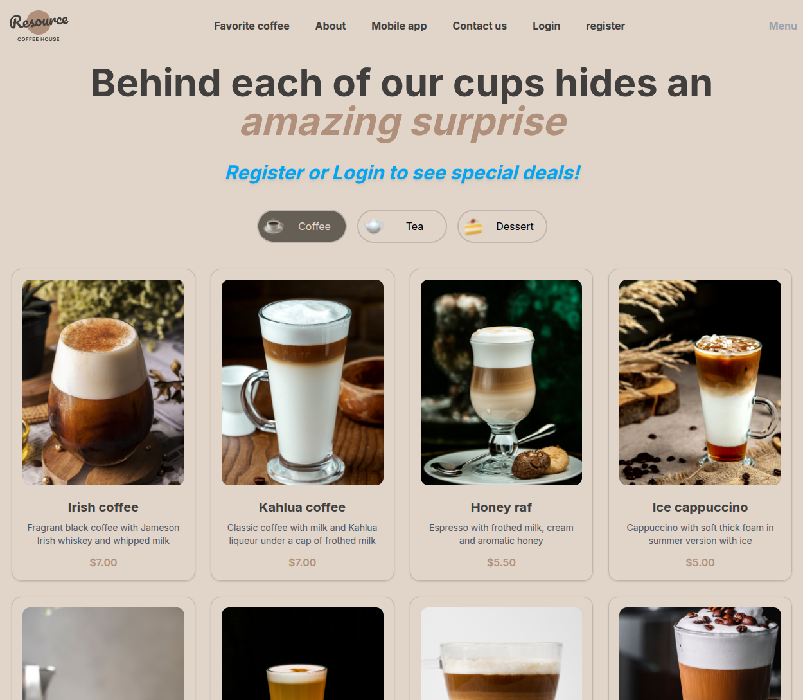

# React version of CoffeeHouse Project

## Frameworks - Libraries

- React
- React Router
- Vite
- TailwindCSS

This is the same project which has been utilized above mentioned framwork and libraries.
I've created the project from scratch!

This new version of Coffee House has some improvements.

- User login & registration process
- Logout feature
- Add-to-cart disabled on no-user
- ..and some more like improving element styles

Deployment: [react-coffee](https://coffee-ex.netlify.app/)
